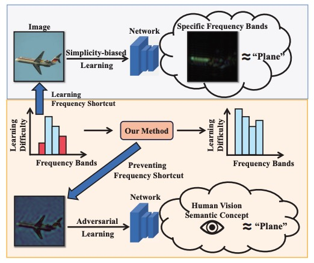

# [NeurIPS'24] Towards Combating Frequency Simplicity-biased Learning for Domain Generalization

<!-- [](https://arxiv.org/abs/2403.02782) 
[](https://bimsarapathiraja.github.io/mccl-project-page/)   -->

This repository gives the official implementation of [Towards Combating Frequency Simplicity-biased Learning for Domain Generalization](https://neurips.cc/virtual/2024/poster/94907) (NeurIPS 2024)

## Introduction
Domain generalization methods aim to learn transferable knowledge from source domains that can generalize well to unseen target domains. Recent studies show that neural networks frequently suffer from a simplicity-biased learning behavior which leads to over-reliance on specific frequency sets, namely as frequency shortcuts, instead of semantic information, resulting in poor generalization performance. Despite previous data augmentation techniques successfully enhancing generalization performances, they intend to apply more frequency shortcuts, thereby causing hallucinations of generalization improvement. In this paper, we aim to prevent such learning behavior of applying frequency shortcuts from a data-driven perspective. Given the theoretical justification of models' biased learning behavior on different spatial frequency components, which is based on the dataset frequency properties, we argue that the learning behavior on various frequency components could be manipulated by changing the dataset statistical structure in the Fourier domain. Intuitively, as frequency shortcuts are hidden in the dominant and highly dependent frequencies of dataset structure, dynamically perturbating the over-reliance frequency components could prevent the application of frequency shortcuts. To this end, we propose two effective data augmentation modules designed to collaboratively and adaptively adjust the frequency characteristic of the dataset, aiming to dynamically influence the learning behavior of the model and ultimately serving as a strategy to mitigate shortcut learning.

<p align="center"></p>

## Setup the environment
Install PyTorch:
```bash
pip3 install torch torchvision torchaudio
```
Other versions of PyTorch could be install [here](https://pytorch.org/get-started/locally/).

## Shortcut Evaluation
The code of frequency shortcut evaluation could be found [here](https://github.com/nis-research/nn-frequency-shortcuts).

## Citation

```
@inproceedings{
anonymous2024towards,
title={Towards Combating Frequency Simplicity-biased Learning for Domain Generalization},
author={Anonymous},
booktitle={The Thirty-eighth Annual Conference on Neural Information Processing Systems},
year={2024},
url={https://openreview.net/forum?id=VMiLdBkCJM}
}
```
